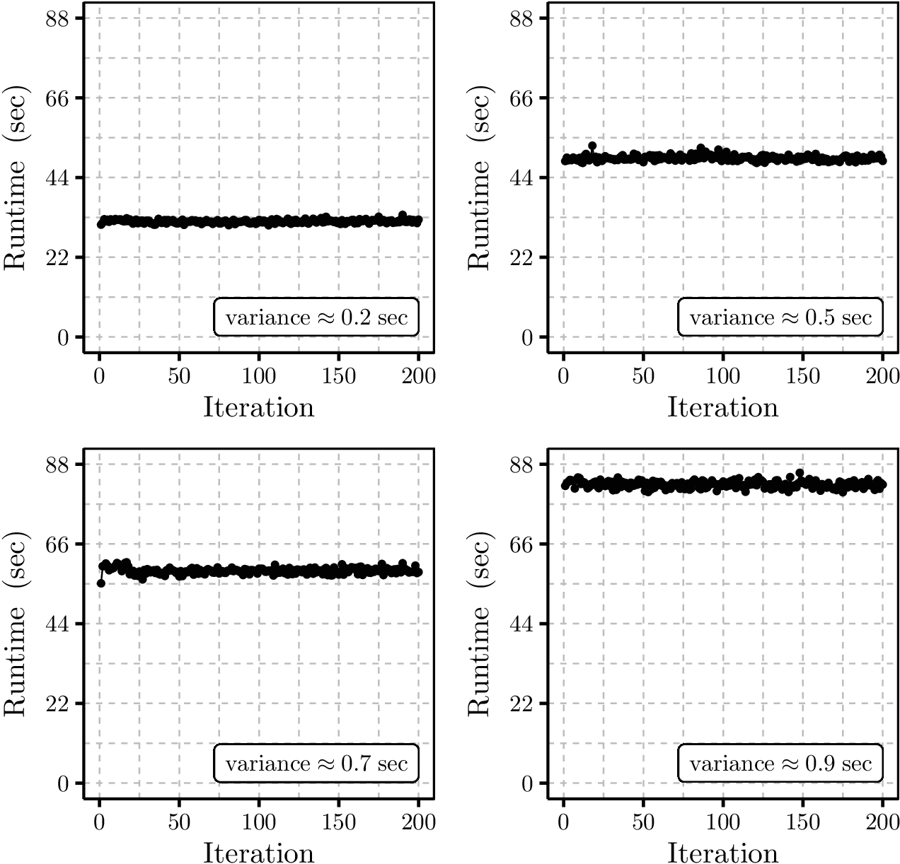

# Stan-Overclocking-Benchmarker

Benchmarking Stan under Dynamic Overclocking with ThrottleStop.

---

<figure style="width:509px;">
  
  <figcaption>Figure 1. Example runtimes for Stan's Bayesian inference with and without system overclocking. Inference of type Ia supernovae cosmological parameters was used as an example problem. Runtime variance was lower under overclocking. Hyperthreading was counterproductive. Execution configurations, moderated by ThrottleStop, were...  

&nbsp;&nbsp; Top (left) overclocking, physical cores, (right) no overclocking, physical cores. 
&nbsp;&nbsp; Bottom (left) overclocking, logical cores, (right) no overclocking, logical cores.

Adapted from Stenborg (2025), below.</figcaption>
</figure>

---

### Key Files

- StanOverclockingBenchmarker.Rmd &nbsp;&nbsp; R markdown. Incorporates Stan's R interface, RStan. 

### Software Requirements

- Ghostscript 10.00.0. 
- PowerShell. 
- R. 
- R IDE, e.g., RStudio. 
- ThrottleStop (recommended). 
- Windows 11. 

<b>Ghostscript</b> &nbsp;&nbsp; The code was not designed for use with Ghostscript more recent than version 10.00.0. 

<b>PowerShell</b> &nbsp;&nbsp; Typically installed by default in Windows 10 and 11. 

<b>ThrottleStop</b> &nbsp;&nbsp; The code was designed for use with ThrottleStop, but will run without it. 

<b>Windows</b> &nbsp;&nbsp; The code was designed for Windows 11. It <i>may</i> run on Windows 10. 

### Software Configuration

<b>Admin Execution</b> &nbsp;&nbsp; The code is designed for execution with administrator privileges, i.e. RStudio was invoked via the Windows "Run as administrator" option. 

<b>Ghostscript</b> &nbsp;&nbsp; It's assumed Ghostscript is available on the system, and an invocation path has been set in the RStudio environment variables "GS_CMD" and "R_GSCMD", i.e., the path to a relevant executable such as "gswin64c.exe". 

<b>Stan</b> &nbsp;&nbsp; Please ensure the RStan package is installed in R. It's assumed R and RStudio have been configured to enable execution of RStan code. For more information, see: [The R Interface to Stan](https://mc-stan.org/rstan/). 

### Reference

Stenborg, TN 2025, "[Benchmarking Stan under Dynamic Overclocking with ThrottleStop](https://www.aspbooks.org/publications/538/265.pdf)", in S Gaudet, D Bohlender, S Gwyn, A Hincks, and P Teuben (eds), Astronomical Data Analysis Software and Systems XXXII, Astronomical Society of the Pacific Conference Series, vol 538, pp. 265&ndash;268.
